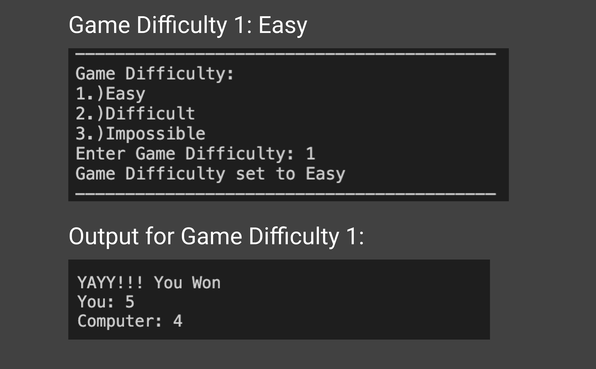
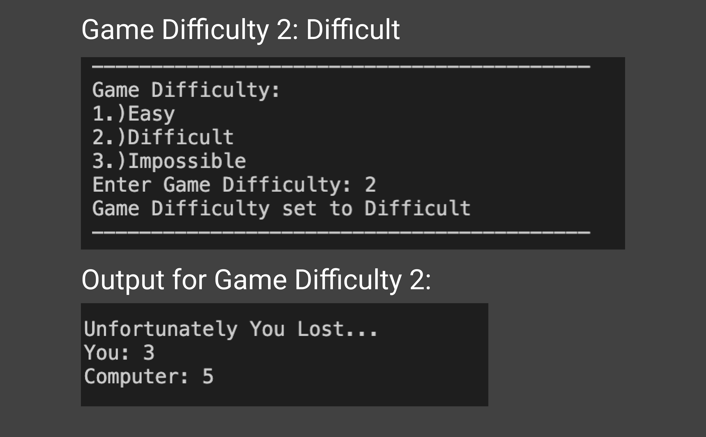
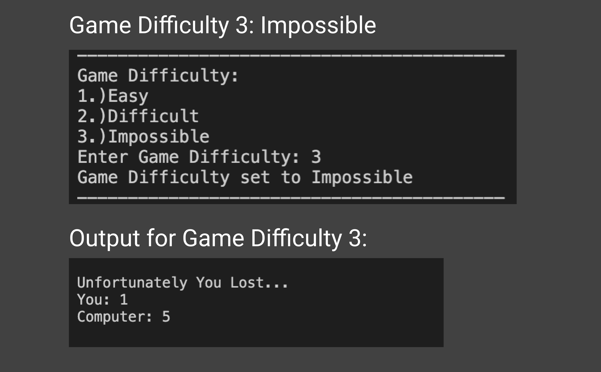

# Rock-Paper-Scissors-Python
 Rock Paper Scissors using Python.

## 100 Days of Code
 Day 3:
  - Commenced Basic Working of game without concept of difficulty
 Day 4:
  - Added Rules of game.
  - Added Three difficulty levels: Easy, Difficult, Impossible

## Images of Output After Day 4:

  
  
  